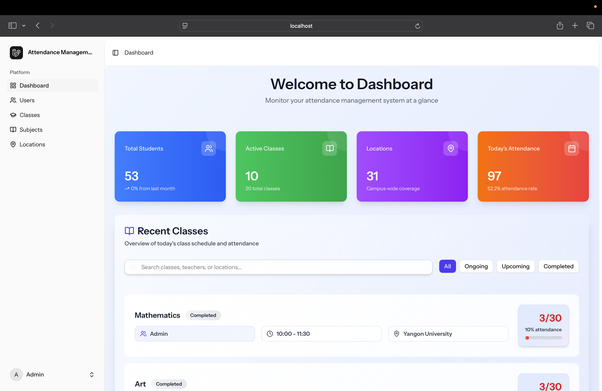
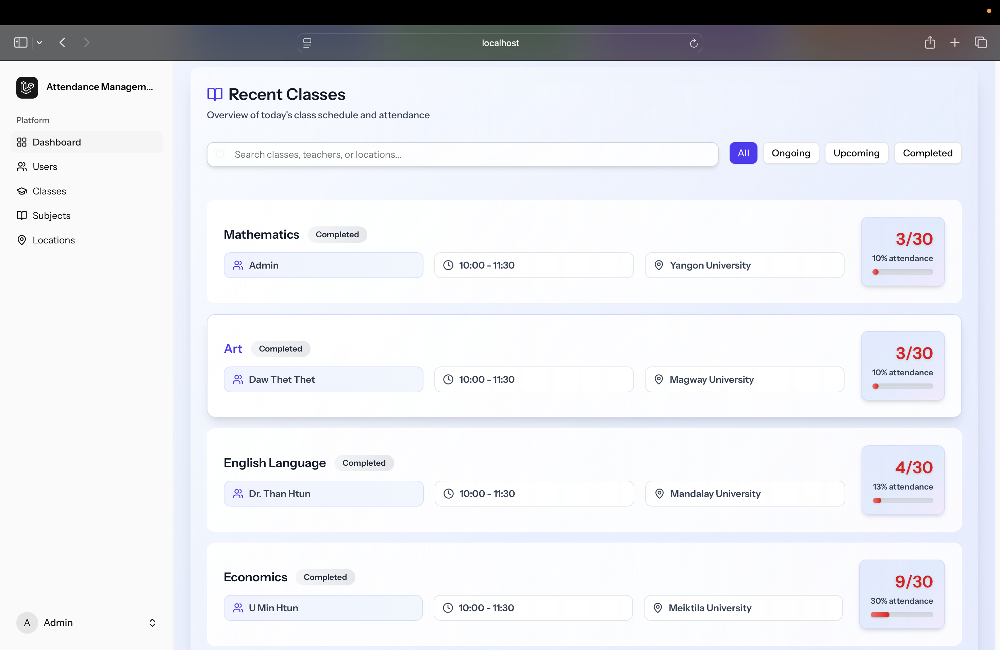
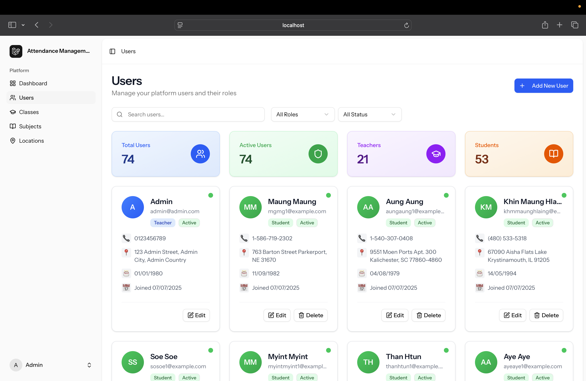
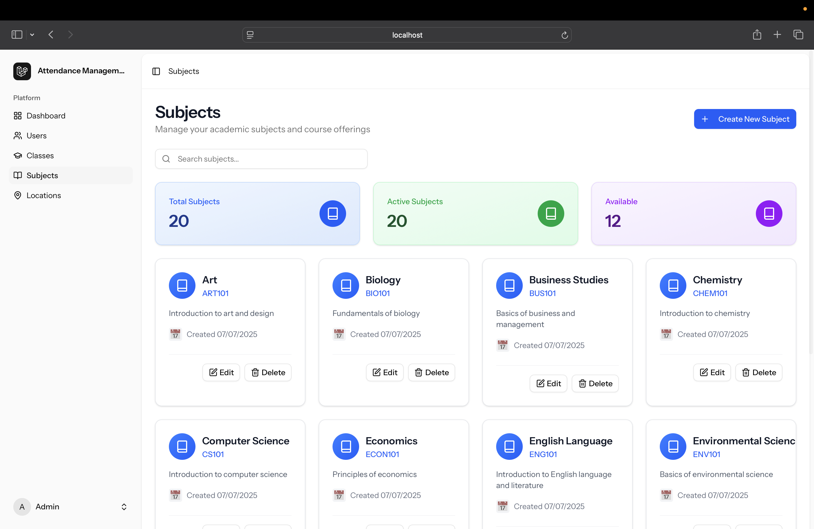
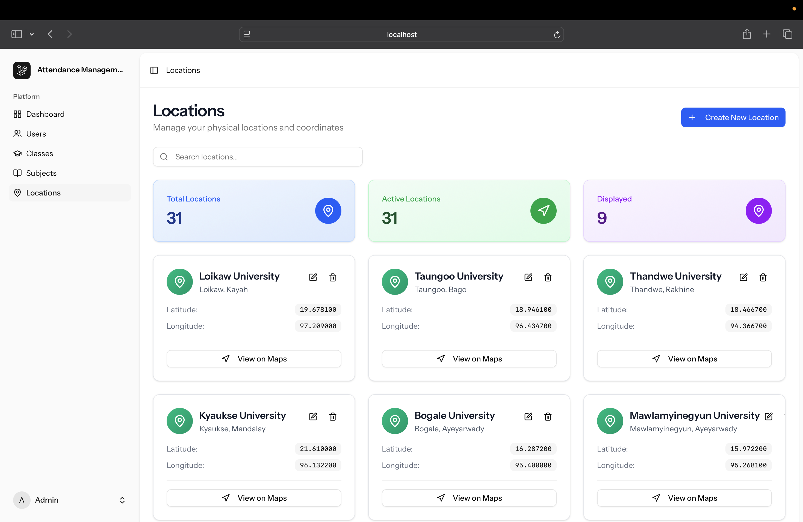
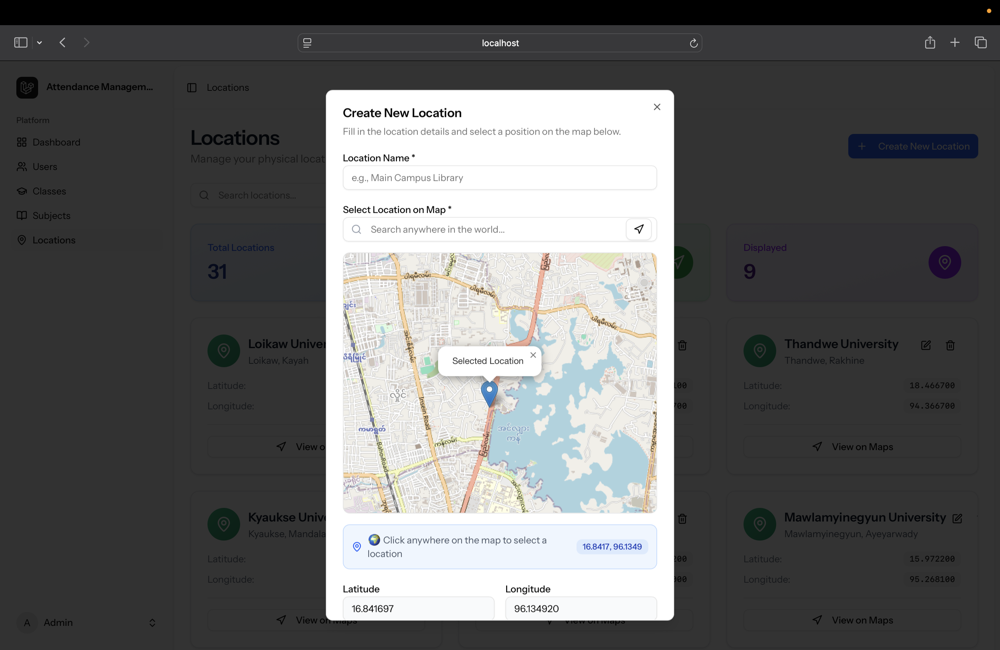
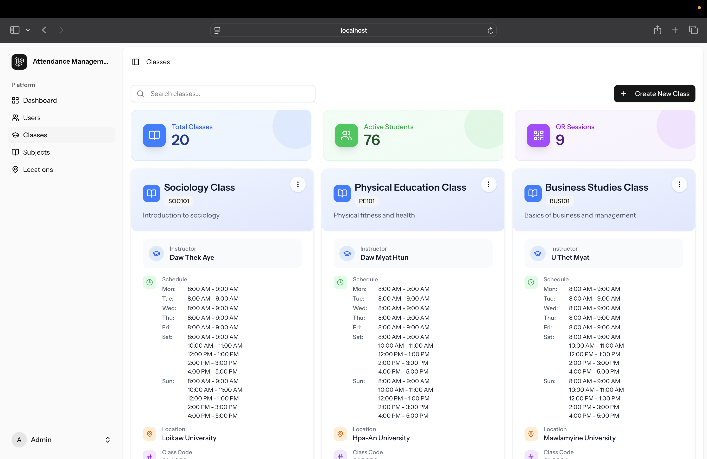
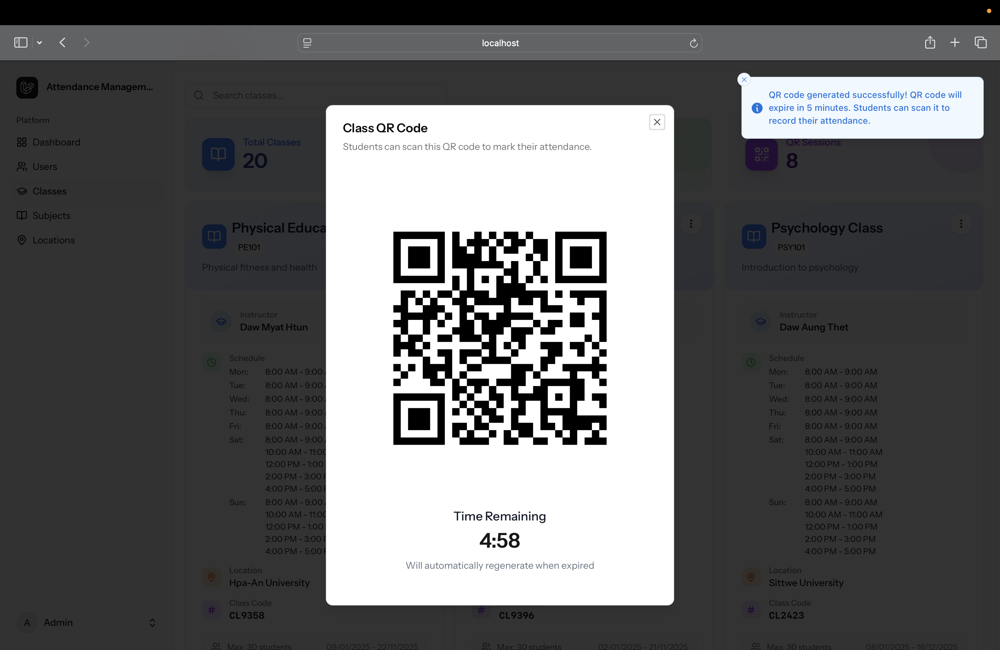

# 📸 Attendance Management System Screenshots

Easily visualize the main features of the Attendance Management System. Each step below includes a screenshot for clarity.

---

## 1. Dashboard

> The dashboard provides a quick overview of classes, attendance stats, and recent activity.

---

## 2. Recent Classes

> View a list of your most recently accessed or updated classes.

---

## 3. User Management

> Manage teacher and student accounts, roles, and statuses.

---

## 4. Subject Management

> Add, edit, or remove academic subjects for your classes.

---

## 5. Location List

> Browse and manage all available class locations.

---

## 6. Create Location

> Add a new physical location for classes, including address and coordinates.

---

## 7. Class List

> See all classes, filter by subject, teacher, or location.

---

## 8. Class QR Code

> Each class session generates a unique QR code for secure attendance marking.

---

---

> ℹ️ Place your screenshots in the `images/` directory with the corresponding filenames for them to display correctly.
